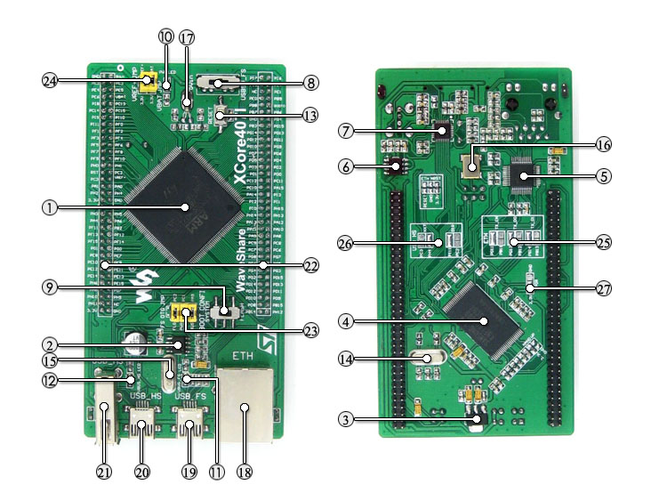

# XCore407I

Trying to implement something on USB HS

1. **STM32F407IGT6**, 168MHz, 192+4kB SRAM, 1024kB Flash
2. MIC2075-2, onboard USB FS power management device
3. AMS1117-3.3, 3.3V voltage regulator
4. **K9F1G08U0E**, 1G Bit NandFlash (128 megabytes)
5. DP83848, Ethernet PHY
6. **MIC2075-1**, onboard USB HS power management device
7. **USB3300**, USB HS PHY
8. Power supply switch, powered from 5Vin or USB connection
9. Boot mode switch, for configuring BOOT0 pin
10. Power indicator
11. USB FS LED
12. USB HS LED
13. Reset button
14. **8M crystal**, MCU clock, enables the MCU run at higher speed by frequency multiplication
15. **24M crystal**, USB3300 clock
16. 50M crystal, DP83848 clock
17. **32.768K crystal**, for internal RTC with calibration
18. Ethernet connector
19. USB FS mini connector
20. **USB HS mini connector**
21. USB HS type A connector
22. MCU pins expander, VCC, GND and all the idle I/O ports are accessible on expansion connectors for further expansion
23. USB OTG/HOST jumper
24. VREF/VBAT jumper
25. Ethernet I/O selection solder joint
26. USB HS I/O selection solder joint
27. PDR selection solder joint: 1.8-3.6V, -40～105℃ OR 1.7-3.6V, 0～70℃

[Hardware](https://www.waveshare.com/xcore407i.htm)

